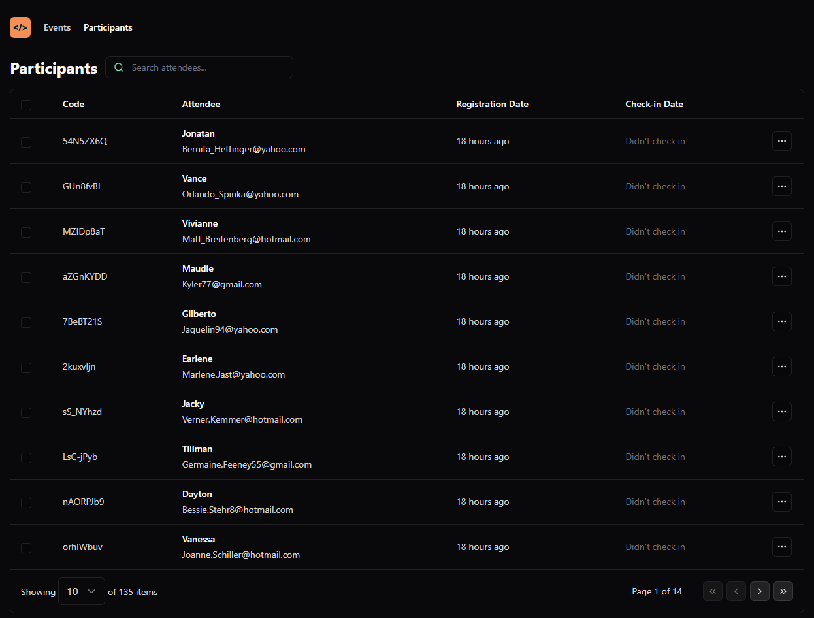
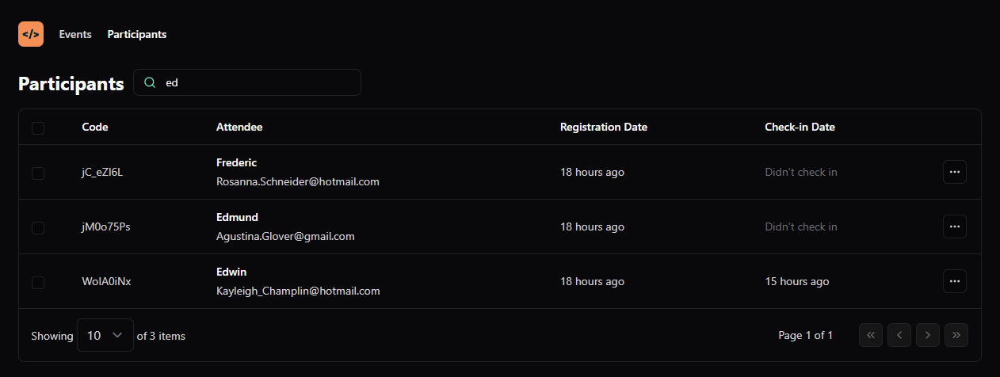
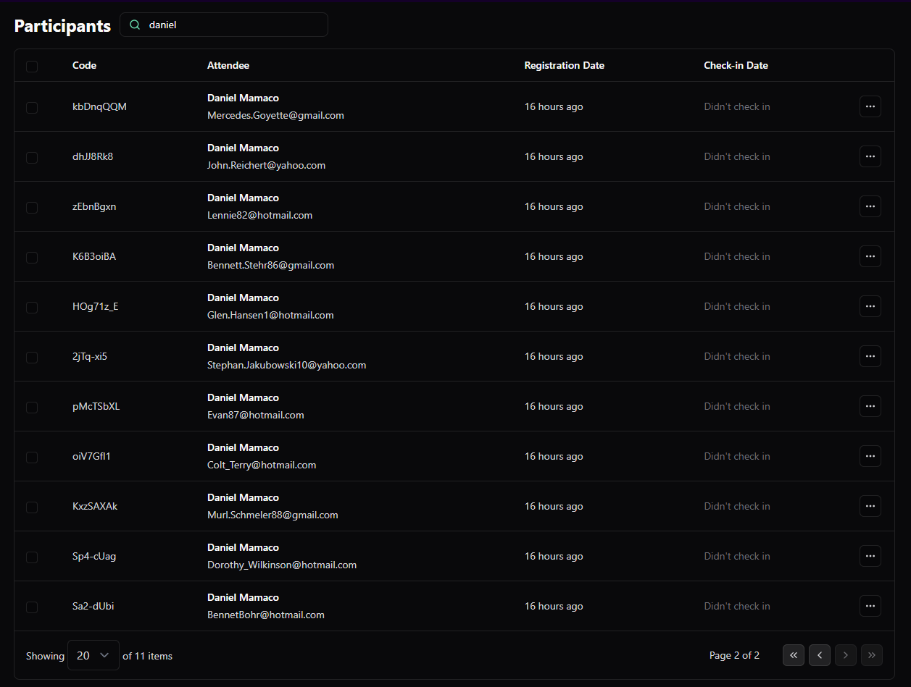

<p align="center">
  <a href="" rel="noopener">
 </a>
</p>
<h1 align="center">pass.in</h1>

<div align="center">

[]() <br>

</div>

---

## 📝 Table of Contents <a name = "en"></a>

- **[About](#about)**
- **[Getting Started](#getting_started)**
- **[Screenshots](#screenshots)**
- **[Project Structure](#project_structure)**
- **[Technologies](#built_using)**

## 📚 About <a name = "about"></a>

Pass.in is a web application that allows users to manage events and attendees. It provides a ReactJS application page to handle with attendees.

The app was built with ReactJS, TypeScript, TailwindCSS, Axios and others

## 🏁 Getting Started <a name = "getting_started"></a>

These instructions will allow you to get a copy of the project and run the application locally for development and testing purposes.

### Prerequisites

- First, you need to have NodeJS installed on your machine. To do this, access the official NodeJS website by clicking [here](https://nodejs.org/) and follow the installation instructions for your operating system.<br />

### Installation

1. Clone the repository using the command or download the .zip file and extract the contents:

   ```sh
   git clone https://github.com/lukeskw/react-events-passin
   ```

2. Access the project folder

3. Install the project dependencies

   ```sh
   npm install
   ```

4. Run the project in development mode

   ```sh
   npm run dev
   ```

## 🎈 Screenshots <a name="screenshots"></a>

### pass.in homepage

<p align="center">
  <a href="" rel="noopener">
 </a>
</p>

### pass.in search

<p align="center">
  <a href="" rel="noopener">
 </a>
</p>

### pass.in pagination

<p align="center">
  <a href="" rel="noopener">
 </a>
</p>

## 📁 Project Structure <a name = "project_structure"></a>

The project structure is as follows:

```
├── src/ : Folder where the application files are located.
│   ├── assets/ : Directory for static assets like images, fonts, etc.
│   ├── components: React components used throughout the application.
│   ├── data/ : Contains fake data generated using Faker.js for testing and development.
│   ├── hooks/ : Custom React hooks to encapsulate common logic.
│   ├── lib/ : Libraries and utilities used in the project, including Axios for HTTP requests.
│   ├── pages/ : React components representing different pages of the application.
│   ├── App.tsx: Main application component that acts as the entry point.
│   ├── index.css: CSS file for styling using Tailwind CSS.
│   ├── main.tsx: Entry point for the React application, where it's mounted to the DOM.
├── index.html: Main HTML file that loads the React application.
├── package.json: File containing project metadata and dependencies managed by npm.
├── .eslintrc.cjs: ESLint configuration file for linting JavaScript/TypeScript code.
├── .prettier.config.cjs: Prettier configuration file for code formatting rules.
├── tsconfig.json: TypeScript configuration file for compiler options.
├── tsconfig.node.json: TypeScript configuration specifically for Node.js.
├── vite.config.ts: Configuration file for Vite, the build tool used in this project.
├── tailwind.config.js: Tailwind CSS configuration file for customizing the framework.
└── postcss.config.js: PostCSS configuration for transforming styles with plugins.

```

## ⛏️ Technologies <a name = "built_using"></a>

- [x] [TypeScript](https://www.typescriptlang.org/) - A superset of JavaScript that adds static type definitions, enhancing code quality and developer productivity.
- [x] [ReactJS](https://reactjs.org/) - A JavaScript library for building user interfaces, providing a component-based architecture and efficient rendering.
- [x] [Tailwind CSS](https://tailwindcss.com/) - A utility-first CSS framework used for styling, providing a low-level utility approach for building custom designs.
- [x] [Tailwind Forms](https://github.com/tailwindlabs/tailwindcss-forms) - A Tailwind CSS plugin that provides styles for form elements, simplifying the design of forms.
- [x] [Tailwind Merge](https://github.com/tailwindlabs/tailwindcss-merge) - A Tailwind CSS plugin that adds utilities for merging utility classes, enabling more flexible and concise styling.
- [x] [Vite](https://vitejs.dev/) - A blazing fast build tool for modern web development, offering instant server start and optimized build times.
- [x] [Axios](https://axios-http.com/) - A promise-based HTTP client for making requests to APIs, used for handling asynchronous operations in web applications.
- [x] [Day.js](https://day.js.org/) - A lightweight and fast JavaScript library for parsing, validating, manipulating, and formatting dates.
- [x] [Lucide React](https://lucide.dev/) - A library of SVG icons as React components, offering a collection of customizable for use in web applications.

> These technologies have been chosen to provide a modern, efficient, and developer-friendly environment for building your application. Links are provided for each technology for further exploration and reference.
